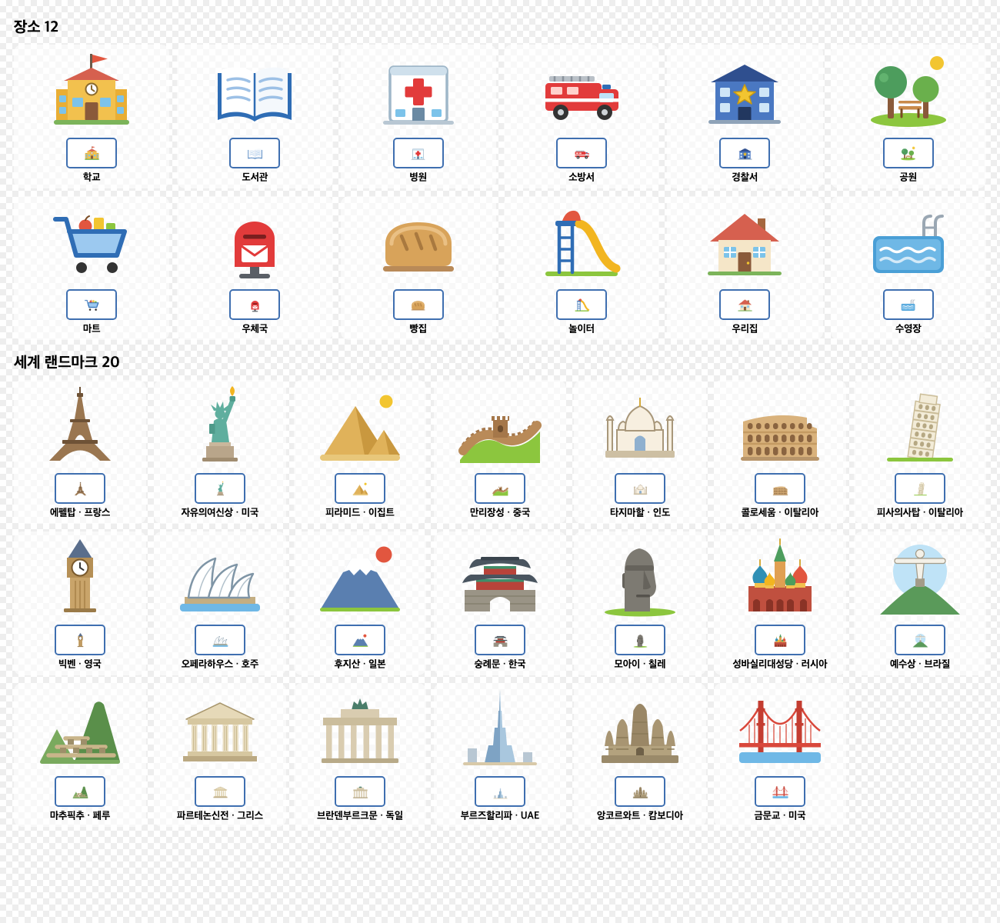

# 신규생성 예시 그림

신규생성 카테고리에서 장소 카드의 **그림 고르기**로 바로 쓸 수 있는 그림입니다.
모두 440×440 투명 배경 PNG이고, 넣으면 긴 변 220px로 자동 축소됩니다.

## 장소 12 — `places/`

학교, 도서관, 병원, 소방서, 경찰서, 공원, 마트, 우체국, 빵집, 놀이터, 우리집, 수영장

## 세계 랜드마크 20 — `landmarks/`

| 번호 | 랜드마크 | 나라 |
|---|---|---|
| 01 | 에펠탑 | 프랑스 |
| 02 | 자유의 여신상 | 미국 |
| 03 | 피라미드 | 이집트 |
| 04 | 만리장성 | 중국 |
| 05 | 타지마할 | 인도 |
| 06 | 콜로세움 | 이탈리아 |
| 07 | 피사의 사탑 | 이탈리아 |
| 08 | 빅벤 | 영국 |
| 09 | 오페라하우스 | 호주 |
| 10 | 후지산 | 일본 |
| 11 | 숭례문 | 한국 |
| 12 | 모아이 | 칠레 |
| 13 | 성 바실리 대성당 | 러시아 |
| 14 | 예수상 | 브라질 |
| 15 | 마추픽추 | 페루 |
| 16 | 파르테논 신전 | 그리스 |
| 17 | 브란덴부르크 문 | 독일 |
| 18 | 부르즈 할리파 | UAE |
| 19 | 앙코르와트 | 캄보디아 |
| 20 | 금문교 | 미국 |

## 받는 방법

GitHub 레포의 `examples` 폴더에서 파일을 열고 다운로드 버튼을 누르거나,
레포 전체를 **Code → Download ZIP**으로 받으면 됩니다.
